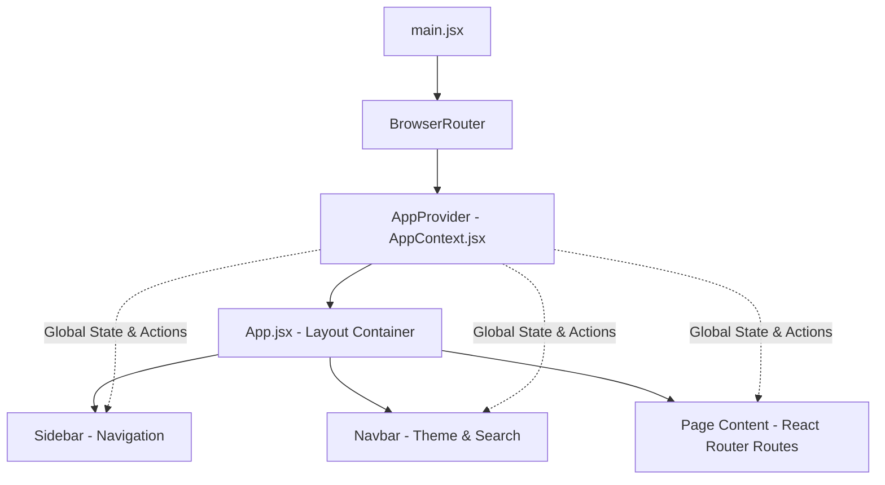

# 🌌 AdX Infinity — Technical & Architecture Deep-Dive

Welcome to the comprehensive technical documentation for **AdX Infinity**. This document is designed to give you a deep, line-by-line and concept-by-concept understanding of the entire application. It covers the system design, the data structures and algorithms (DSA) utilized, the file structure, and detailed code-block explanations.

---

## 1. Project Overview & Tech Stack

**AdX Infinity** is a simulated real-time advertising exchange console. It mimics an ad-tech administrative dashboard where users can monitor and manage critical server metrics, incoming browser requests, network topology, routing delays, and campaign yields.

### Core Technologies
1. **React 19 (JavaScript)**: Chosen for UI component-driven rendering, reactive state management, and SPA (Single Page Application) routing.
2. **Vite**: Used as the frontend build tool and local development bundler, enabling fast Hot Module Replacement (HMR).
3. **Tailwind CSS v3**: Utilized for utility-first responsive layout design. A custom Tailwind plugin is integrated to support parent-selector light mode toggling.
4. **Framer Motion**: Enables smooth animations (e.g., list transitions, slide-out mobile drawer, network graph packet traversal).
5. **Recharts**: Powers the svg-based interactive analytical charts (Area and Bar charts).
6. **React Icons (Lucide/Feather pack)**: Provides a uniform icon language (`FiHome`, `FiClock`, `FiZap`, etc.).
7. **React Router Dom (v7)**: Handles client-side page routing without requesting new HTML documents from a server.

---

## 2. System Architecture & Context Flow

The application follows a central state management architecture using **React Context API**.



1. **`main.jsx`** bootstraps the application and wraps it in `BrowserRouter` and `AppProvider`.
2. **`AppContext.jsx`** acts as a client-side mock database. It reads state from `localStorage` on initialization and writes back to it on state changes, enabling persistent settings.
3. **`App.jsx`** acts as the primary layout wrapper, controlling page layouts and hosting the toast notification alert overlay and mobile drawer backdrop.

---

## 3. Data Structures & Algorithms (DSA) Explained

AdX Infinity demonstrates several foundational computer science concepts:

### A. Queue (First In, First Out - FIFO)
* **Where**: `src/utils/queue.js` and `src/pages/LiveBidArena.jsx`.
* **Concept**: Real-time bidding platforms receive bids from browsers that must be processed sequentially. A queue ensures that the first bid to arrive is the first to be evaluated.
* **Operations**:
  * **Enqueue**: Appends an incoming bid to the end of the array.
  * **Dequeue**: Processes and removes the bid at the head of the array (index `0`), shifting remaining items forward.

### B. Stack (Last In, First Out - LIFO)
* **Where**: `src/utils/stack.js` and `src/pages/BudgetTimeMachine.jsx`.
* **Concept**: When administrators adjust advertising budgets, they may make mistakes. To restore previous configurations, budget adjustments are treated as historical checkpoints pushed onto a stack. Clicking "Undo" pops the most recent history state off the stack, restoring the previous budget.
* **Operations**:
  * **Push**: Appends a change checkpoint to the top (front) of the stack.
  * **Peek**: Examines the top checkpoint without removing it.
  * **Pop**: Removes the top checkpoint to transition back to the previous state.

### C. Weighted Graph & Dijkstra's Algorithm
* **Where**: `src/utils/graph.js` and `src/pages/DeliveryRoute.jsx`.
* **Concept**: Advertisements must traverse global proxy networks to reach user browsers. This network is modeled as a graph where servers are **nodes** and network cables are **edges** with latency weights (in milliseconds).
* **Dijkstra's Algorithm**: Finding the path that minimizes total latency.
  1. Initializes distances to all nodes as `Infinity`, except the source node which is `0`.
  2. Selects the unvisited node with the smallest distance.
  3. Relaxes all its active neighbors: if the distance to a neighbor through the current node is smaller than its recorded distance, the neighbor's distance is updated, and the current node is marked as its predecessor.
  4. Repeats until the destination node is visited.
  5. Backtracks from the destination via predecessors to assemble the shortest path.

### D. Greedy Load Balancing
* **Where**: `src/context/AppContext.jsx` (`uploadAd` action) and `src/pages/StorageBalancer.jsx`.
* **Concept**: When media creatives (banners, videos) are uploaded, they are stored on edge servers. To prevent overloading a single node, a greedy sorting algorithm scans all servers and assigns the incoming creative to the server with the lowest current storage usage.

---

## 4. File-by-File Technical Breakdown

### `src/main.jsx`
* **Purpose**: Mounts the React application tree inside the root DOM node (`<div id="root">`).
* **Code Block Analysis**:
  * Wraps the application in `<React.StrictMode>` to catch development warnings.
  * Contextualizes the routing system via `<BrowserRouter>`.
  * Contextualizes the state variables via `<AppProvider>`.

### `src/App.jsx`
* **Purpose**: Houses the application grid layout, toast notification alerts, routing tables, and the AI float icon trigger.
* **Code Block Analysis**:
  * Uses `<Sidebar />` on the left and a content wrapper on the right containing the header `<Navbar />` and `<main>`.
  * Employs Framer Motion's `<AnimatePresence>` to animate toast notifications smoothly when they appear and disappear.

### `src/context/AppContext.jsx`
* **Purpose**: Declares and manages global state objects. Saves modifications back to the browser's `localStorage`.
* **Code Block Analysis**:
  * **`load` helper**: Standardizes parsing values from `localStorage`, wrapping them in `try/catch` to return fallback values if the stored string is corrupt.
  * **`uploadAd`**:
    ```javascript
    const uploadAd = () => {
      setServers((items) => {
        // Sort servers ascending by current storage load
        const target = [...items].sort((a, b) => a.storage - b.storage)[0];
        // Distribute 80 more ads to the target server and update storage percentage
        return items.map((server) =>
          server.id === target.id
            ? { ...server, ads: server.ads + 80, storage: Math.min(98, Math.round(((server.ads + 80) / server.capacity) * 100)) }
            : server
        );
      });
      notify("Ad asset auto-assigned to lightest server");
    };
    ```
    This block represents our **Greedy Load Balancing** algorithm, targeting the server with the lowest load first.

### `src/utils/queue.js`
* **Purpose**: Functional, immutable array manipulation representing a queue.
* **Code Block Analysis**:
  * `enqueue`: Uses the spread operator `[...queue, item]` to append a bid.
  * `dequeue`: Uses `queue.slice(1)` to return a new array omitting the first element without mutating the original state.
  * `removeFromQueue`: Filters out the deleted item by checking `item.id !== id`.

### `src/utils/stack.js`
* **Purpose**: Functional, immutable array manipulation representing a LIFO stack.
* **Code Block Analysis**:
  * `pushChange`: Appends the change to the head of the list: `[change, ...stack]`.
  * `peekChange`: Examines the top element at `stack[0]`.
  * `popChange`: Returns `stack.slice(1)` to remove the top record.

### `src/utils/sorting.js`
* **Purpose**: Sorting wrapper.
* **Code Block Analysis**:
  * `sortCampaigns`: Sorts campaigns descending or ascending based on `roi` field, returning a new array `[...campaigns].sort(...)`.

### `src/utils/graph.js`
* **Purpose**: Holds the Dijkstra shortest-path pathfinder implementation.
* **Code Block Analysis**:
  * Maps distances to `Infinity` for all nodes except source (`0`).
  * In a `while (unvisited.size)` loop, it pops the closest unvisited node.
  * Scans edge weights, relax distances of unvisited neighbors, and records the optimal node's `id` inside a tracking dictionary `previous`.
  * Rebuilds the final path using a backtracking loop:
    ```javascript
    const path = [];
    let cursor = destination;
    while (cursor) {
      path.unshift(cursor);
      cursor = previous[cursor];
    }
    ```

### `tailwind.config.js`
* **Purpose**: Overrides default styles and registers plugins.
* **Code Block Analysis**:
  * Custom `light:` variant registration:
    ```javascript
    plugins: [
      plugin(function({ addVariant }) {
        addVariant("light", ".light &");
      })
    ]
    ```
    Registers a custom CSS selector match. Tailwind generates rules matching `.light .light\:<class-name>`. When the `light` class is added to `document.body`, all custom light variables apply automatically.

### `src/styles.css`
* **Purpose**: Custom global CSS.
* **Code Block Analysis**:
  * Sets up standard cyberpunk CSS components like `.glass` (semi-transparent panel with a subtle white border and backing blur) and `.cyber-grid` (a repeating layout with radial background gradients mimicking monitor console grids).
  * Implements webkit scrollbar custom styles.

---

## 5. View & Component Analysis

### Components:
1. **`Navbar.jsx`**: Hosts the search input, mock notifications count, theme switcher, and the mobile hamburger toggle.
2. **`Sidebar.jsx`**: Displays navigation links. If the view width drops below `lg` (1024px), it is styled as a mobile drawer positioned off-screen (`-translate-x-full`), sliding in when `mobileMenuOpen` is toggled.
3. **`Charts.jsx`**: Generates charting elements. `RevenueChart` outputs a Recharts `AreaChart` styled with an emerald-to-rose gradient fill. `RoiBarChart` renders custom bar colors based on rank.
4. **`Timeline.jsx`**: Generates a layout using vertical tracking lines to display budget history.

### Pages:
1. **`Dashboard.jsx`**: Serves as the landing hub displaying overall KPI statistics, an SVG success circular progress dial, and system activity logs.
2. **`Inventory.jsx`**: Renders ad spacing nodes. Features a form to add inventory slots, dynamic search filtering, and toggling between card grid and vertical list layouts.
3. **`BudgetTimeMachine.jsx`**: Renders budget states. Employs the `Stack` helpers to allow users to update budgets and travel back to restore previous checkpoints.
4. **`LiveBidArena.jsx`**: Implements the FIFO bid queue simulator, displaying items horizontally using Framer Motion animations.
5. **`AudienceDNA.jsx`**: Implements the AI profile analyzer. It triggers a simulated analysis by counting the string lengths of user inputs and rendering a visual conic-gradient dial alongside a matrix particle animation.
6. **`Profitability.jsx`**: Renders the leaderboard ranking. Features sorting toggles and uses a `useMemo` search to locate the absolute best-performing campaign:
   ```javascript
   const highestRoiCampaignId = useMemo(() => {
     if (!campaigns || !campaigns.length) return null;
     return [...campaigns].sort((a, b) => b.roi - a.roi)[0]?.id;
   }, [campaigns]);
   ```
   This ensures that the leaderboard winner's crown stays on the highest campaign regardless of whether it's sorted high-to-low or low-to-high.
7. **`PublisherGalaxy.jsx`**: Displays interactive publisher nodes on a layout. Selecting a node draws dynamic SVG connector links matching target nodes.
8. **`DeliveryRoute.jsx`**: Simulates graph traversal. Users select source and destination servers, and clicking "Find Fastest Route" invokes Dijkstra's pathfinder. It triggers a rocket icon animation (`🚀`) traversing the coordinates in order.
9. **`StorageBalancer.jsx`**: Visualizes mock hard drives and storage distribution charts using greedy load balancing.
